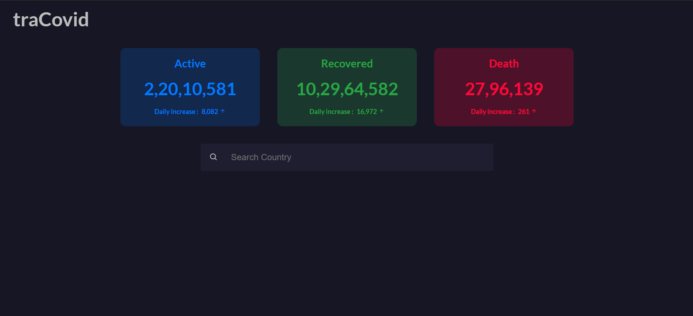

# traCovid - A Simple Covid-19 tracking app
 
## This project is made using React.js

### This project uses the https://disease.sh/ API to display the data about daily increment in active, deaths and recovered cases.

#### User's can also see details about a specific country.
